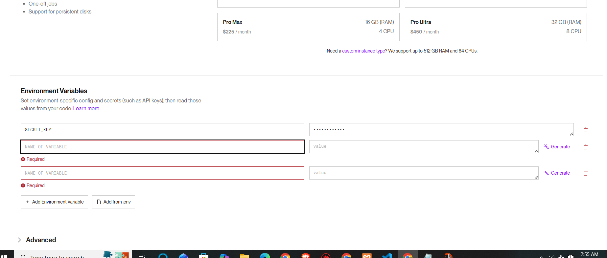
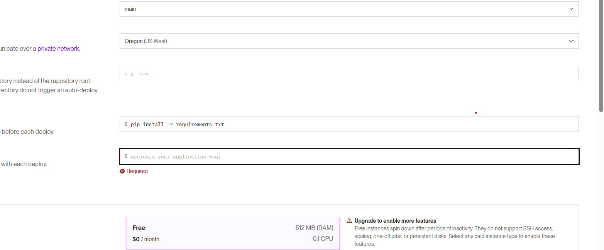

# Background Remover - AI-Powered Image Processing

A web application that removes image backgrounds using AI and applies custom colors or patterns.

## 🎯 Features

- **AI Background Removal**: Intelligent background detection using rembg library
- **Custom Background**: Apply solid colors or keep transparent background
- **Fast Processing**: Optimized for speed with automatic image downsampling
- **Easy Download**: Download processed images as PNG
- **Web-Based UI**: Simple, responsive interface with no installation needed

## 📋 Prerequisites

- **Python 3.12+** (tested on Python 3.12.3)
- **XAMPP or MySQL** server running on localhost:3306
- **pip** package manager

## 🚀 Quick Start

### 1. Clone/Setup

```bash
# Background Remover

A small web project that removes image backgrounds using an AI model and exposes a simple frontend to upload images and download processed results.

This README contains focused, up-to-date instructions for running the project locally.

**Highlights**
- API: backend built with Django + Django REST Framework
- Frontend: static UI served from `frontend/` (simple single-page app)
- Background removal: powered by `rembg` (optional heavy dependency)
- Tasks: Celery/Redis were removed — image processing runs synchronously in-process

---

## Requirements

- Python 3.12+
- Git (optional)
- (Optional) MySQL server if you want to use MySQL as configured. The project ships with a `db.sqlite3` for quick local use.

Note: `rembg` (and `onnxruntime`) are large and pull several heavy packages; install the full requirements only when you need AI processing.

---

## Quick Local Setup (recommended)

1. Create and activate a virtual environment from the repository root:

```powershell
python -m venv .venv
& .venv\Scripts\Activate.ps1
```

2. Install the minimal packages required to run the web app (fast):

```powershell
pip install Django djangorestframework pillow python-decouple dj-database-url whitenoise
```

3. (Optional) To enable full AI background removal, install the heavy requirements:

```powershell
pip install -r backend/requirements.txt
```

4. Database options:
- Default (quick): use the SQLite file `backend/db.sqlite3` — change `DATABASES` in `backend/config/settings.py` to `sqlite:///db.sqlite3` if needed.
- MySQL (optional): the repository may be configured to connect to a local MySQL at `localhost:3306` — update credentials in `backend/config/settings.py` or set up environment-specific configuration.

5. Run Django migrations and start the backend server:

```powershell
cd backend
.\manage.py migrate
.\manage.py runserver 0.0.0.0:8000
```

6. Start the frontend (separate terminal):

```powershell
cd frontend
.\.\venv\Scripts\python.exe -m http.server 3000 --bind 127.0.0.1
# or if your venv is active:
# python -m http.server 3000 --bind 127.0.0.1
```

7. Open the UI at: http://127.0.0.1:3000

The frontend posts to `http://127.0.0.1:8000/api/process/` by default.

---

## Notes and troubleshooting

- CORS: a simple permissive CORS middleware is included at `backend/config/cors_middleware.py` for local testing.
- If you see `ModuleNotFoundError: No module named 'rembg'` when processing images, install the full requirements (see step 3).
- If you prefer SQLite for simplicity, set `DATABASES` in `backend/config/settings.py` to use `sqlite:///db.sqlite3` and rerun migrations.
- Celery/Redis: removed. Background tasks now run synchronously in `backend/apps/images/tasks.py`.
- Render deployment docs and Render-specific settings were removed from project files.

---

## Project layout

- `backend/` — Django project and API
  - `apps/images/` — models, views, services (background removal), and tasks
  - `config/` — Django settings and URL configuration
- `frontend/` — static single-page UI (`index.html`, `app.js`, `style.css`)

---

If you'd like, I can now:
- update `backend/config/settings.py` to read DB credentials from environment variables, or
- revert to using SQLite by default, or
- commit these README changes.

Tell me which option you prefer.
| DRF | 3.15.1 | REST API |
| rembg[onnx] | 2.0.57 | AI background removal |
| Pillow | 10.2.0 | Image processing |
| onnxruntime | 1.17.1 | AI model inference |
| numpy | 1.26.4 | Numerical computing |
| mysqlclient | 2.2.4 | MySQL database driver |

## 📝 Notes

- This is a development setup (not for production)
- All images are processed locally - nothing is uploaded to cloud
- First run may take 5+ minutes while AI model downloads
- Processed images are returned as base64 data URLs

## 🎓 Technologies Used

- **Backend**: Django 5.0 + Django REST Framework
- **Frontend**: HTML5, CSS3, Vanilla JavaScript ES6+
- **AI**: rembg (RemBG library with ONNX models)
- **Database**: MySQL
- **Server**: Python built-in http.server

---

**Created**: January 2026  
**Status**: Development  
**Python**: 3.12+
